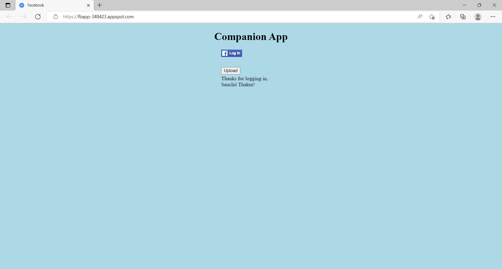
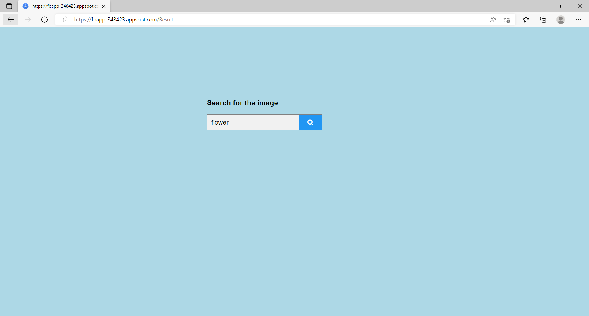
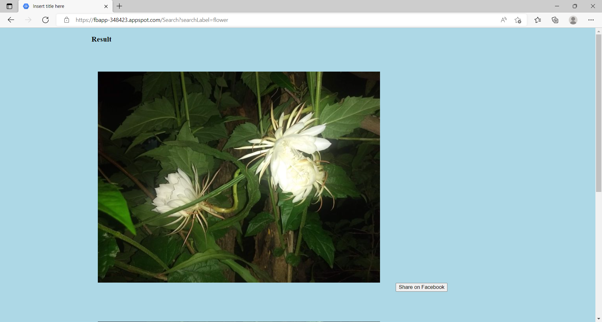
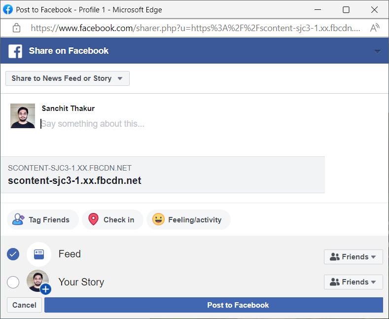
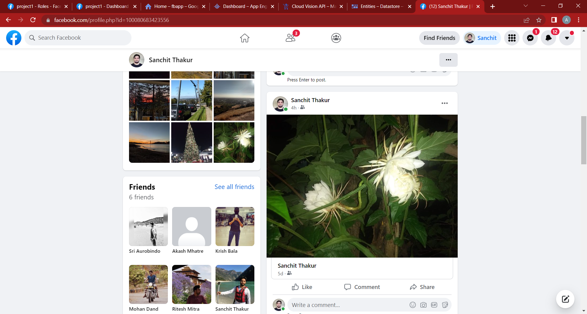
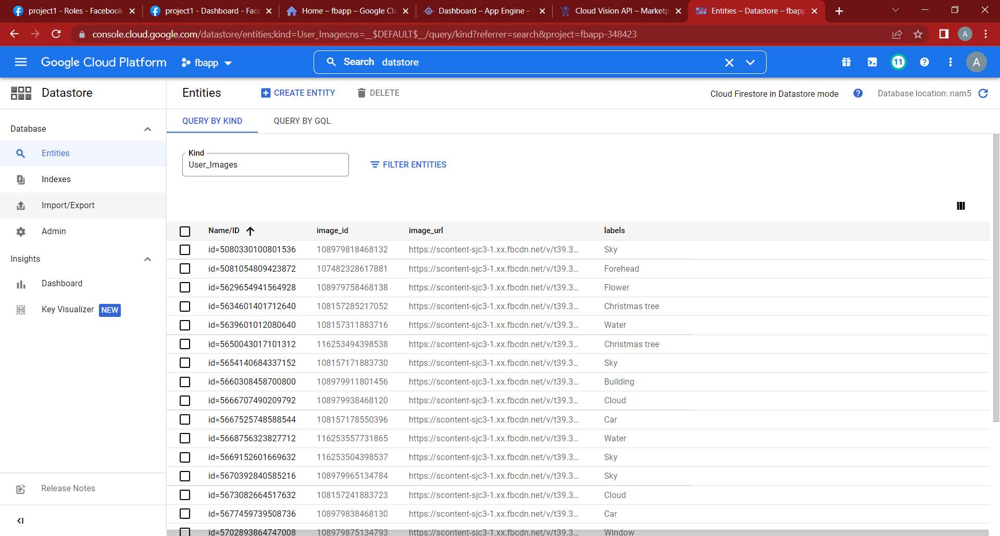
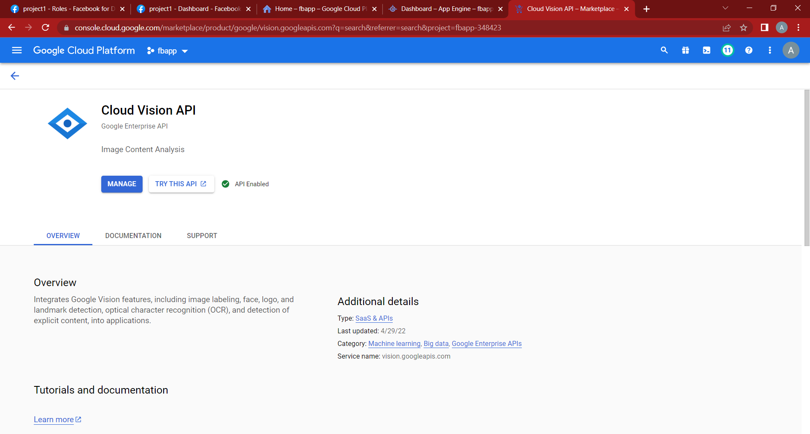
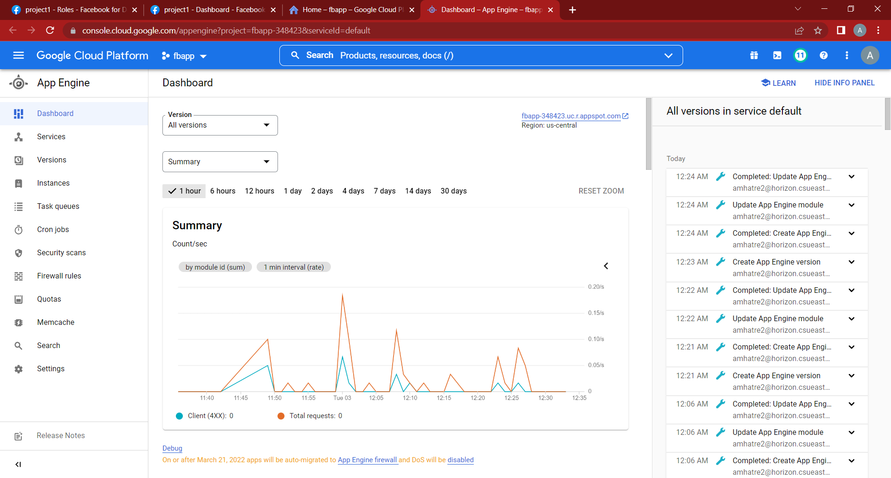
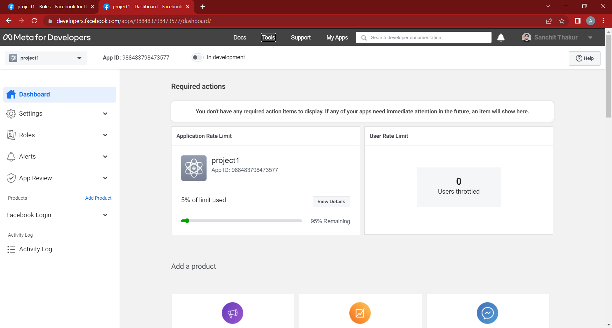
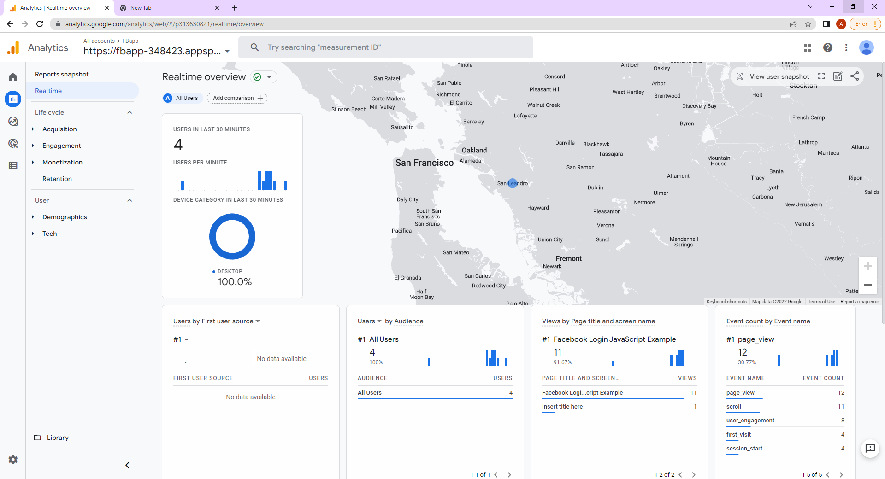

# facebook_app
 
## Introduction
For this project, we have created an application which allows the user to upload images from Facebook for search and get suggestions by using a tool called the Graph API. After the Images are uploaded the images are sent to Google Cloud Vision to analyze the uploaded images dn return the labels for the images and these labels are used for searching the images. The uploaded images are stored in Google Datastore. The searched images can be shared on facebook.

## Application Link: https://fbapp-348423.uc.r.appspot.com/

## Table of contents:
### Proposal
### Description
### Demonstration of Application working
### GAE Issues and GAE Datastore
### Java Code Documentation
### Code
### Analytics Project 1 Proposal

#

## Proposal:

Using Facebook Photos API and Google Cloud Storage and Computer Vision API's to detect objects in an image and creating clusters of objects for classification of images.

The application will retrieve a Facebook photo from the user’s Facebook profile using Graph API and use the retrieved photo for processing results through Google SaaS Computer Vision API .
The result then will be used for Google Analytics Platform (App Engine Server Side Analytics) as it provides computing resources to collect, store, process, and report on these user-interactions to detect objects and start creating clusters of the object based on the similarity of the object to the reference object for image classification.

The application will be able to access the photos of users on his/her Facebook profile using the Facebook Graph API which is the primary way for the application to read and write to the Facebook Social Graph then the photos will be stored in Google DataStore. The Google VisionAI will be used to extrapolate data from photos to detect the objects and will return appropriate labels with respect to the image. Image object detection information will be used to classify the image. After extrapolation we will store the extrapolated data on the Google DataStore to fetch instantaneous data when called again in future and for further data analytics and exploration.

